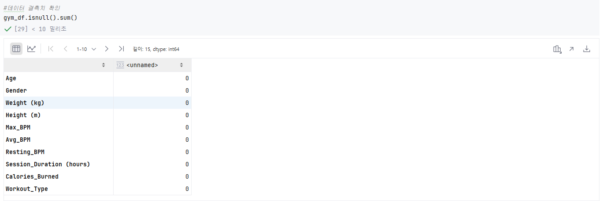
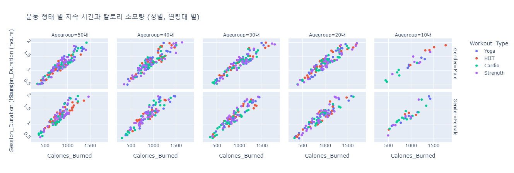

# EDA 보고서

## 주제: 헬스장 회원 분석

### 1. 헬스장 회원 데이터의 소개 및 분석 방향
1. **데이터 출처: Kaggle**
   (https://www.kaggle.com/datasets/valakhorasani/gym-members-exercise-dataset)
    - 해당 데이터셋은 헬스장 회원의 운동 루틴, 신체적 특징, 피트니스 지표에 대한 자세한 개요를 제공
    - 심박수, 소모 칼로리, 운동 기간과 같은 핵심 성과 지표뿐만 아니라.
    - 각 항목에는 인구 통계 데이터, 경험수준도 포함되어 있어 피트니스 패턴, 건강 추세에 대한 포괄적 분석 가능
2. **탐색 목적**: 헬스장 회원들의 정보를 바탕으로 아래의 4가지 주제로 탐색적 자료분석을 하고자 함
   1. 운동종류에 따른 심박수 간의 상관관계
   2. 운동빈도수와 운동유형이 체지방비율에 미치는 영향
   3. 연령대별 운동 선호도 및 그에 따른 칼로리 소모량
   4. 물 섭취량이 소모 칼로리에 미치는 영향

### 2. 데이터 소개
헬스장 회원 데이터는 회원의 인구통계 정보와 운동습관, 심박수 등을 포함하며 주요 컬럼은 다음과 같습니다.
- Age: 나이
- Gender: 성별
- Weight (kg): 체중
- Height (m): 키
- Max_BPM: 최대 심박수
- Avg_BPM: 평균 심박수
- Resting_BPM: 휴식 시 심박수
- Session_Duration (hours): 운동 시간(시간 단위)
- Calories_Burned: 소모 칼로리
- Workout_Type: 운동 종류
- Fat_Percentage: 체지방률
- Water_Intake (liters): 수분 섭취량(리터)
- Workout_Frequency (days/week): 주간 운동 빈도
- Experience_Level: 운동 경력
- BMI: 체질량지수 (BMI)

### 3. 주제별 자료분석 및 해석
1. **분석 목표** : 운동
2. **분석 목표** : 성별 - 연령대별 어떤 운동을 선호하는 지와 그 운동의 칼로리 소모량의 연관관계 파악

#### 1. 기초 통계

Head(). 데이터의 상단부 출력.

info(). 데이터의 기초적인 정보 파악

describe(). 데이터 값들의 일괄적인 개요 파악

결측치 확인 - 해당 데이터는 결측치가 파악되지 않음.

운동 유형 별 누계 확인 - 유형이 4가지임을 확인할 수 있었다.

데이터 분리 / 스캐일링 / 선형회기를 통한 점수 확인

#### 2. 시각화

시각화를 위한 연령대 범주화

성별 별 운동 선호도

해당 표를 통해 남성은 근력 운동을 여성은 유산소 운동을 가장 선호한다는 것을 파악할 수 있었다. 

연령대 별 운동 선호도

해당 표를 통해 중장년 층은 요가와 근력운동을, 낮은 연령대는 유산소 운동을 선호한다는 것을 알 수 있다.

지속 시간에 따른 운동 형태 별 칼로리 소모 산점도

일반적인 인식처럼 장시간 운동시 높은 칼로리를 소모하며, 유산소 운동이 타 운동 형태에 비해 칼로리를 덜 소모한다는 사싱을 발견할 수 있었다.

위 산점도를 성별 연령대 별로 쪼갠 산점도

2030 청년 층이 타 연령층에 비해 높은 칼로리 소모양을 보여줌을 확인할 수 있었다.

#### 3. 상관관계도

변수들을 ('Age','Session_Duraiton (hours)','Calories_Burned',Gender_numeric) 이용해 상관관계도 출력

칼로리 소모양과 지속 시간은 높은 상관관계를 보이지만, 연령과 성별은 그렇지 못한 모습을 확인할 수 있었다.

### 4. 결론
- 성별 연령대 별 비교적 선호하는 운동 유형을 확인할 수는 있었지만 그 수치가 절대적이지 않다.
- 유산소 운동이 장시간 운동 대비 높은 칼로리를 소모하지 못한다는 것이 인상적이었다.
- 성별과 연령이 칼로리 소모와 음의 상관관계를 가진다는 걸 파악할 수 있었다.

### 5. 향후 분석 방향 
- 현재 데이터의 특성간에는 특별한 상관관계가 있다고 보기 어려움 
  - 다른 다양한 변수들 간의 연관성을 찾는다.

