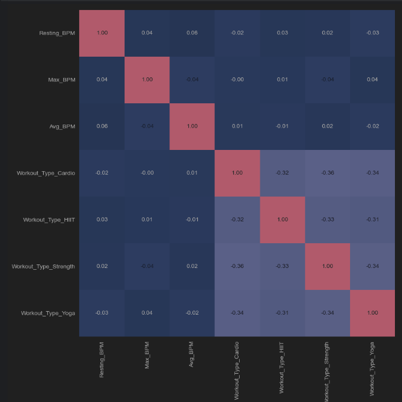
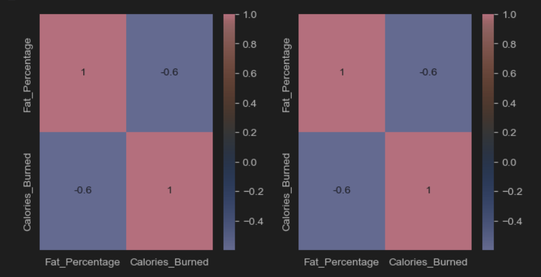
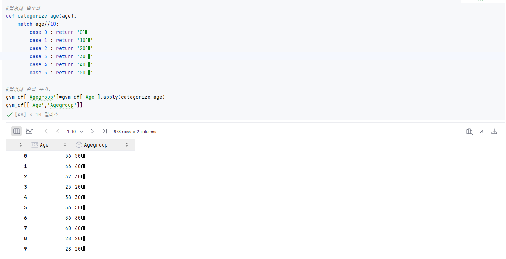
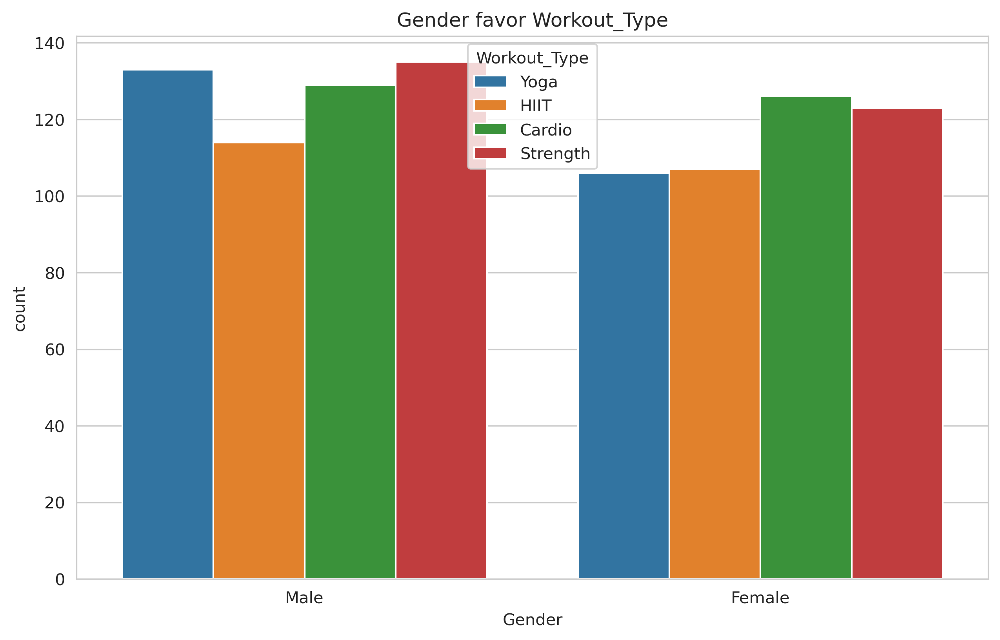
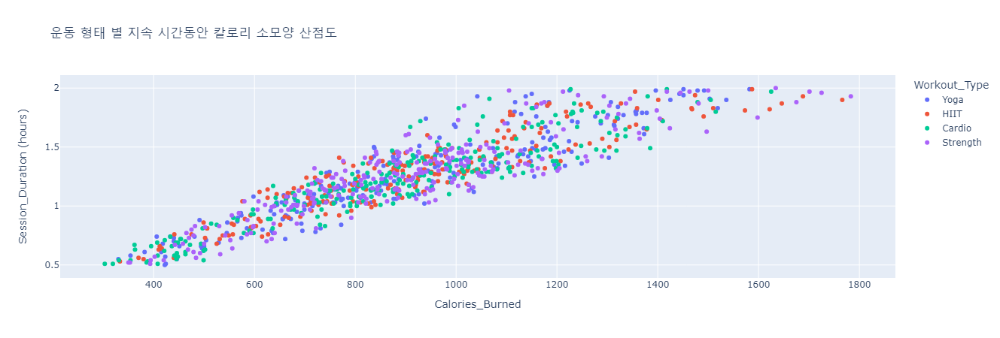
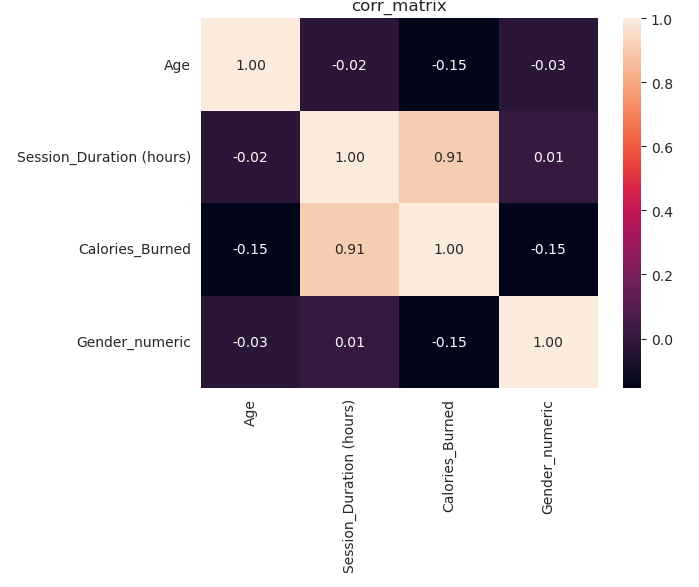

# EDA 보고서

## 주제: 헬스장 회원 분석

## 1. 헬스장 회원 데이터의 소개 및 분석 방향
1. **데이터 출처: Kaggle**
   (https://www.kaggle.com/datasets/valakhorasani/gym-members-exercise-dataset)
    - 해당 데이터셋은 헬스장 회원의 운동 루틴, 신체적 특징, 피트니스 지표에 대한 자세한 개요를 제공
    - 심박수, 소모 칼로리, 운동 기간과 같은 핵심 성과 지표뿐만 아니라.
    - 각 항목에는 인구 통계 데이터, 경험수준도 포함되어 있어 피트니스 패턴, 건강 추세에 대한 포괄적 분석 가능
2. **탐색 목적**: 헬스장 회원들의 정보를 바탕으로 아래의 4가지 주제로 탐색적 자료분석을 하고자 함
   1. 운동종류에 따른 심박수 간의 상관관계
   2. 운동빈도수와 운동유형이 체지방비율에 미치는 영향
   3. 연령대별 운동 선호도 및 그에 따른 칼로리 소모량
   4. 물 섭취량이 소모 칼로리에 미치는 영향

## 2. 데이터 소개
헬스장 회원 데이터는 회원의 인구통계 정보와 운동습관, 심박수 등을 포함하며 주요 컬럼은 다음과 같습니다.
- Age: 나이
- Gender: 성별
- Weight (kg): 체중
- Height (m): 키
- Max_BPM: 최대 심박수
- Avg_BPM: 평균 심박수
- Resting_BPM: 휴식 시 심박수
- Session_Duration (hours): 운동 시간(시간 단위)
- Calories_Burned: 소모 칼로리
- Workout_Type: 운동 종류
- Fat_Percentage: 체지방률
- Water_Intake (liters): 수분 섭취량(리터)
- Workout_Frequency (days/week): 주간 운동 빈도
- Experience_Level: 운동 경력
- BMI: 체질량지수 (BMI)

## 3. 주제별 자료분석 및 해석

1) **분석목표: 운동 종류에 따른 심박수(`Resting_BPM`, `Max_BPM`, `Avg_BPM`)의 관계와 상관성을 분석하여 운동 유형에 따른 심박수 패턴을 파악하고자 함.**

### 1. 데이터 전처리

- 결측치 확인 및 처리
    
    각 변수에 대해 결측치를 확인하였으며, 해당 데이터는 결측치 값이 없는 데이터로 확인됨.

    
- 이상치 처리
    - 주요 변수(`Max_BPM`, `Avg_BPM`, `Resting_BPM`)에서 박스 플롯을 통해 이상치 확인
    - 주요 변수에서는 이상치가 확인되지 않았음
    
    
    
- 데이터 타입 변환
    - 범주형 변수 `Gender`, `Workout_Type`, `Experience_Level`을 원-핫 인코딩하여 모델이 학습할 수 있도록 수치형 데이터로 변환했습니다.
    - 예) Gender → Gender_Male(Female:0, Male: 1)
    - 예) Workout_Type → Workout_Cardio, Workout_HIIT, Workout_Strength, Workout_Yoga
    - 심박수와 운동 유형 간의 상관관계는 크지 않아, 운동 종류에 따른 심박수 차이는 뚜렷하지 않은 것으로 보임

### 2. 기초 통계 및 시각화

- 기초 통계 요약
    - 각 수치형 변수들의 평균, 중앙값, 표준편차를 계산하여 테이터의 기본 분포 확인
- 분포 시각화
    - 각 심박수(`Resting_BPM`, `Max_BPM`, `Avg_BPM`)의 히스토그램을 통해 분포를 시각화하여 데이터가 특정 구간에 집중되는지 확인하였습니다.
    - 운동 종류별 심박수 분포를 박스 플롯으로 나타내어 각 운동 종류에 따라 심박수의 분포와 차이를 비교하였습니다.

### 3. 운동 종류별 심박수 관계 분석

- 운동 종류별 그룹화 및 평균 비교
    - `Workout_Type`에 따라 `Resting_BPM`, `Max_BPM`, `Avg_BPM`의 평균과 중앙값을 계산하여 운동 유형별 심박수 경향성을 파악하였습니다.
    - 운동 종류별로 심박수의 변화는 미미하였음
- 심박수 변수의 상관관계 분석
    - 각 운동 종류별로 `Resting_BPM`, `Max_BPM`, `Avg_BPM` 간의 상관관계를 계산하여 심박수 지표 간의 관계를 파악하였습니다.
    - 각 운동 종류에 대해 상관관계를 계산하였으며, 이 역시 유의미한 결과를 나타내지 않았음

### 4. 상관관계 시각화

- 히트맵
    - 각 운동 종류별 심박수 변수들(`Resting_BPM`, `Max_BPM`, `Avg_BPM`)의 상관계수를 시각화한 히트맵을 통해 시각적으로 상관관계의 강도 표현
    - 히트맵으로 확인한 결과, 심박수와 운동종류 간의 관계는 유의미하지 않음
    
- 박스플롯
    - 운동 종류별 BPM(rest, Max, Avg) 심박수 분포 확인
    - 확인 결과, 운동 종류별로 심박수의 관계는 유의미한 평가 불가
    
    

### 5. 결론

- 운동 종류와 심박수의 관계
    -심박수 예측을 목표로 입력-타겟데이터 분리 후 모델 선형회귀로 분석 진행한 결과, (0.005183986837664263 -0.0198590029937525)라는 무의미한 점수를 반환함
    - 모든 운동 유형에서 `Resting_BPM`, `Max_BPM`, `Avg_BPM` 간의 상관관계가 매우 낮게 나타나거나 거의 없음.
    - 운동 전 휴식 심박수, 최대 심박수, 평균 심박수가 서로 독립적으로 변화하는 경향이 있으며, 운동 유형에 따라 달라지지 않은 것 같음을 시사
- 향후 분석방향
    - 운동 유형과 심박수 간의 관계는 독립적이며, 심박수가 아닌 다른 수치형 변수들 간의 상관관계를 계산하여 운동 유형과 다른 변수들 간의 유의미한 관계를 찾는다
    - 모델 성능 개선 필요성
        
        현재 데이터의 특성만으로는 최대 심박수 예측 모델의 성능이 낮게 나타났으며, 모델 개선을 위해 추가적인 피처 엔지니어링과 데이터 정체가 필요
        
    - 추가 분석 방향
        - 다른 회귀모델을 시도하여 모델 성능을 비교하고 최적화
        - Max_bpm에 중요한 영향을 미치는 변수를 선별하여 데이터를 추가분석해 모델의 설명력 높이기/

 

***
2) **분석목표: (물 섭취, 체지방량)과 칼로리 소모 관계와 상관성을 분석하고자 함**

### 1. 데이터 전처리
- 결측치 확인 및 처리

- 필요한 column만 추출

- data scaling
  - StandardScaler을 사용해 scaling을 진행

### 2.기초 통계 및 시각화
1. Calories_Burned과 Water_Intake간 관계를 scatter_plot으로 나타냄
2. Calories_Burned과 Fat_Percentage간 관계를 scatter_plot으로 나타냄

3. Calories Burned와 관련 있을 것 같은 변수들 간 관계를 plot으로 나타냄
    - 일반적으로 남성이 같은 기준일 때, 더 많은 칼로리 소모를 보임
    - Workout_Type, Session_Duration, Workout_Frequency, Experience_level
    - 

### 3.Logistic Regression / PolynomialFeatures
- 물 섭취&체지방률이 칼로리 소모에 미치는 영향
-
- 선형회귀 점수가 낮아 다항회귀를 진행하였음
- 

### 4.상관관계 시각화
- heatmap
  - Calories_Burned과 Water_Intake간의 상관계수 행렬을 나타냄
    - 0.36
    
  - Calories_Burned과 Fat_Percentage간의 상관계수 행렬을 나타냄
    - 0.6으로 음의 상관관계를 가짐

### 5.결론
- 물 섭취와 소모 칼로리
  - 상관관계가 매우 낮게 나타나거나 거의 없음.

- 체지방량과 소모 칼로리
  -음의 상관관계를 가짐
  -대체로 체지방량이 낮은 사람이 칼로리 소모가 높다는 것을 알 수 있음

 

***

3) **분석목표: 운동빈도수와 수행되는 운동유형이 체지방비율에 미치는 영향**
### 1. 기초 통계 및 데이터 구조 확인

1)	데이터 샘플 (head): 데이터의 상단부를 출력하여 데이터를 확인하였습니다.
2)	info(): 데이터 타입과 기초 정보를 파악하였으며, 결측치는 없는 것으로 확인되었습니다.
3)	describe(): 각 변수의 주요 통계를 확인하여 운동 빈도와 체지방 비율의 평균, 표준 편차, 최댓값과 최솟값 등을 확인하였습니다.
4)	운동 유형 확인: Workout_Type은 Cardio, Strength, HIIT, Yoga의 4가지 유형으로 구성됨을 확인했습니다.

### 2. 변수 간 관계 시각화

1) 운동 빈도와 체지방 비율의 관계

	-	산점도 분석: 주간 운동 빈도(Workout_Frequency)와 체지방 비율(Fat_Percentage)의 관계를 산점도로 시각화하여, 두 변수 간의 상관 관계를 확인하였습니다.
	-	결과 해석: 운동 빈도가 높아질수록 체지방 비율이 낮아지는 경향이 보였으나, 모든 데이터에서 뚜렷한 선형 관계를 보이지는 않았습니다.

2) 운동 유형과 체지방 비율의 관계

1)	박스플롯 분석: 운동 유형별로 체지방 비율 분포를 비교하기 위해 박스플롯을 사용했습니다.
2)	결과 해석: HIIT와 Strength 운동을 하는 그룹이 상대적으로 체지방 비율이 낮은 경향을 보였으며, 요가와 유산소 운동(Cardio)을 하는 그룹은 체지방 비율이 약간 높은 편임을 확인했습니다.

### 3. 선형 회귀 모델 적용 및 결과 해석

1)	모델 적용: Workout_Frequency, Workout_Type을 독립 변수로, Fat_Percentage를 종속 변수로 하여 Lasso 회귀 모델을 적용했습니다.
2)	평가 지표: 모델의 성능을 평가하기 위해 MSE(Mean Squared Error)를 사용했으며, MSE 값은 약 28.27로 나타났습니다.
3)  회귀 모델 해석:
4)  Workout_Frequency는 체지방 비율을 줄이는 데 긍정적인 영향을 미치는 것으로 나타났습니다. 즉, 운동 빈도가 높아질수록 체지방 비율이 낮아지는 경향이 확인되었습니다.귀를 통한 점수 확인

 

### 2. 시각화

- 시각화를 위한 연령대 범주화

 

- 성별 별 운동 선호도. 

해당 표를 통해 남성은 근력 운동을 여성은 유산소 운동을 가장 선호한다는 것을 파악할 수 있었다. 

 

- 연령대 별 운동 선호도. 

해당 표를 통해 중장년 층은 요가와 근력운동을, 낮은 연령대는 유산소 운동을 선호한다는 것을 알 수 있다.

 

-지속 시간에 따른 운동 형태 별 칼로리 소모 산점도

일반적인 인식처럼 장시간 운동시 높은 칼로리를 소모하며, 유산소 운동이 타 운동 형태에 비해 칼로리를 덜 소모한다는 사싱을 발견할 수 있었다.

 

-위 산점도를 성별 연령대 별로 쪼갠 산점도

2030 청년 층이 타 연령층에 비해 높은 칼로리 소모양을 보여줌을 확인할 수 있었다.

### 3. 상관관계도

변수들을 ('Age','Session_Duraiton (hours)','Calories_Burned',Gender_numeric) 이용해 상관관계도 출력

 

칼로리 소모양과 지속 시간은 높은 상관관계를 보이지만, 연령과 성별은 그렇지 못한 모습을 확인할 수 있었다.

### 4. 결론
- 성별 연령대 별 비교적 선호하는 운동 유형을 확인할 수는 있었지만 그 수치가 절대적이지 않다.
- 유산소 운동이 장시간 운동 대비 높은 칼로리를 소모하지 못한다는 것이 인상적이었다.
- 성별과 연령이 칼로리 소모와 음의 상관관계를 가진다는 걸 파악할 수 있었다.

### 5. 향후 분석 방향 
- 현재 데이터의 특성간에는 특별한 상관관계가 있다고 보기 어려움 
  - 다른 다양한 변수들 간의 연관성을 찾는다.

