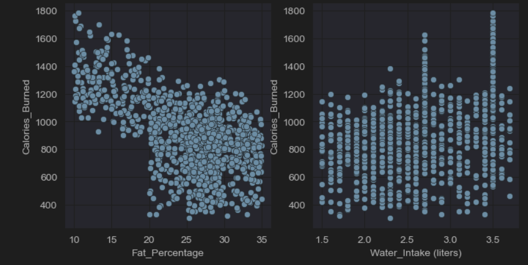

2) **분석목표: (물 섭취, 체지방량)과 칼로리 소모 관계와 상관성을 분석하고자 함**

### 1. 데이터 전처리
- 결측치 확인 및 처리

- 필요한 column만 추출

- data scaling
  - StandardScaler을 사용해 scaling을 진행

### 2.기초 통계 및 시각화
1. Calories_Burned과 Water_Intake간 관계를 scatter_plot으로 나타냄
2. Calories_Burned과 Fat_Percentage간 관계를 scatter_plot으로 나타냄

3. Calories Burned와 관련 있을 것 같은 변수들 간 관계를 plot으로 나타냄
    - 일반적으로 남성이 같은 기준일 때, 더 많은 칼로리 소모를 보임
    - Workout_Type, Session_Duration, Workout_Frequency, Experience_level
    - 

### 3.Logistic Regression / PolynomialFeatures
- 물 섭취&체지방률이 칼로리 소모에 미치는 영향
-
- 선형회귀 점수가 낮아 다항회귀를 진행하였음
- 

### 4.상관관계 시각화
- heatmap
  - Calories_Burned과 Water_Intake간의 상관계수 행렬을 나타냄
    - 0.36
    
  - Calories_Burned과 Fat_Percentage간의 상관계수 행렬을 나타냄
    - 0.6으로 음의 상관관계를 가짐

### 5.결론
- 물 섭취와 소모 칼로리
  - 상관관계가 매우 낮게 나타나거나 거의 없음.

- 체지방량과 소모 칼로리
  -음의 상관관계를 가짐
  -대체로 체지방량이 낮은 사람이 칼로리 소모가 높다는 것을 알 수 있음

